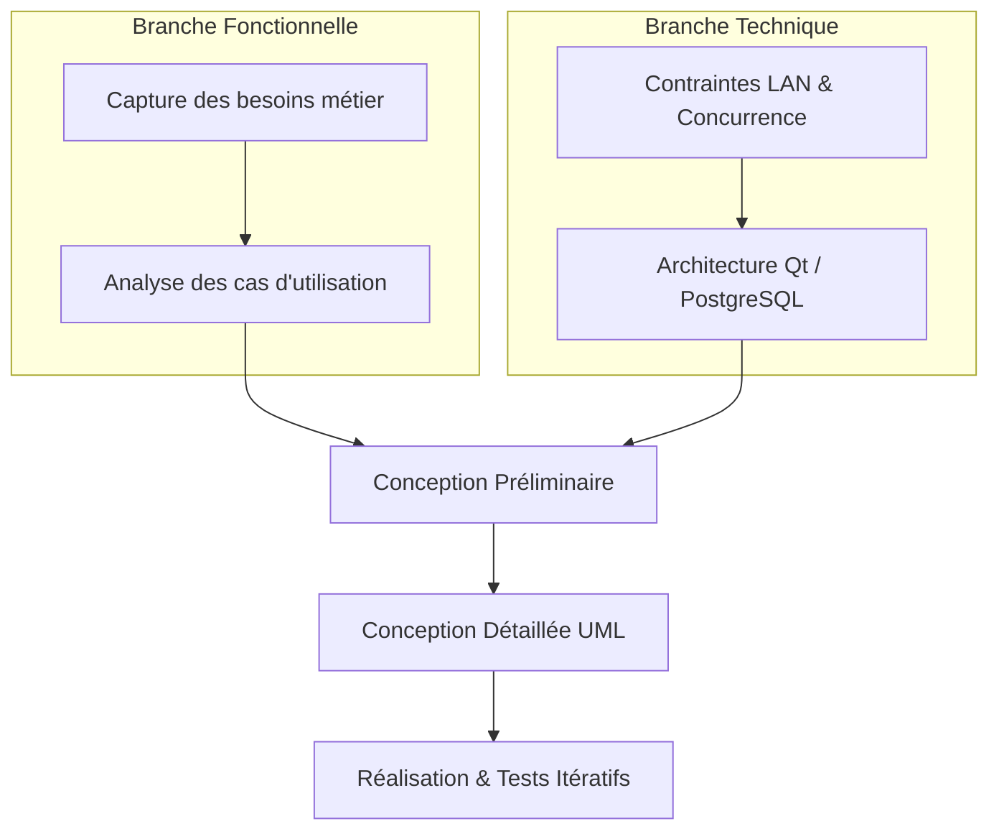
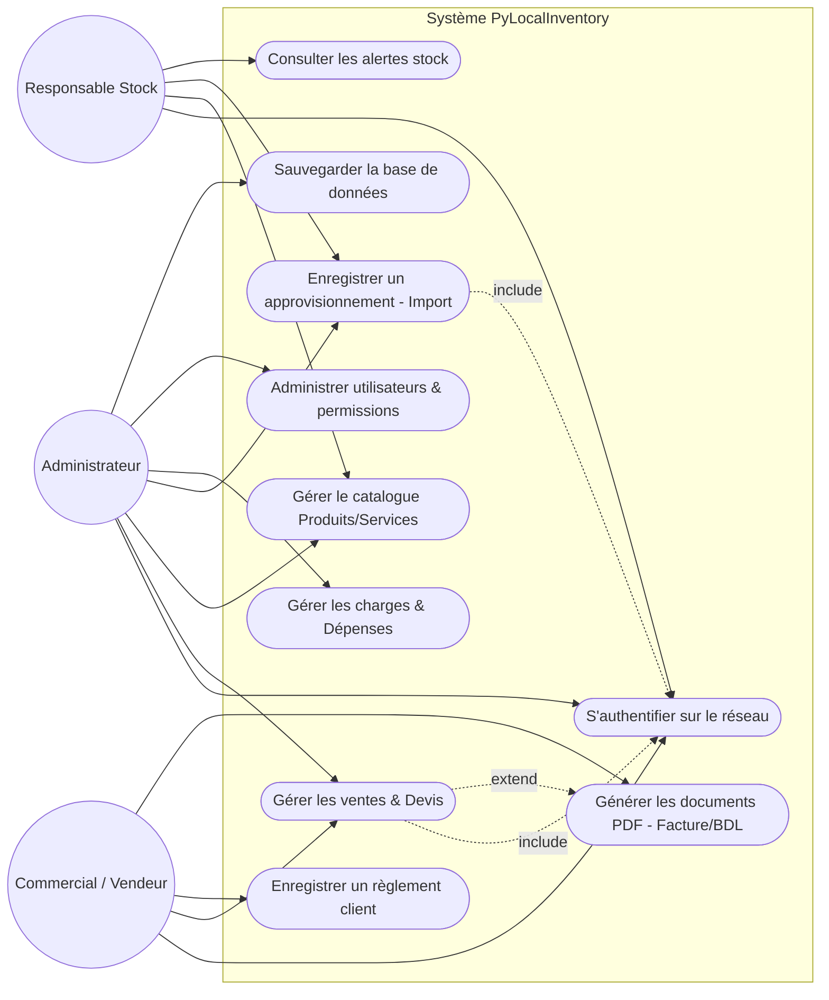
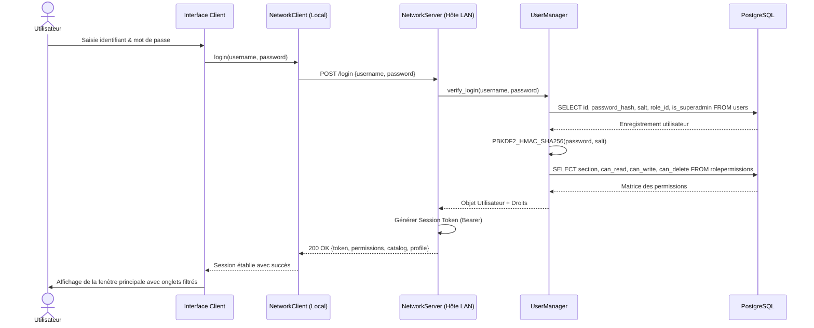
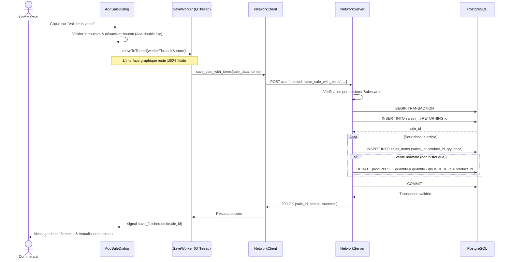
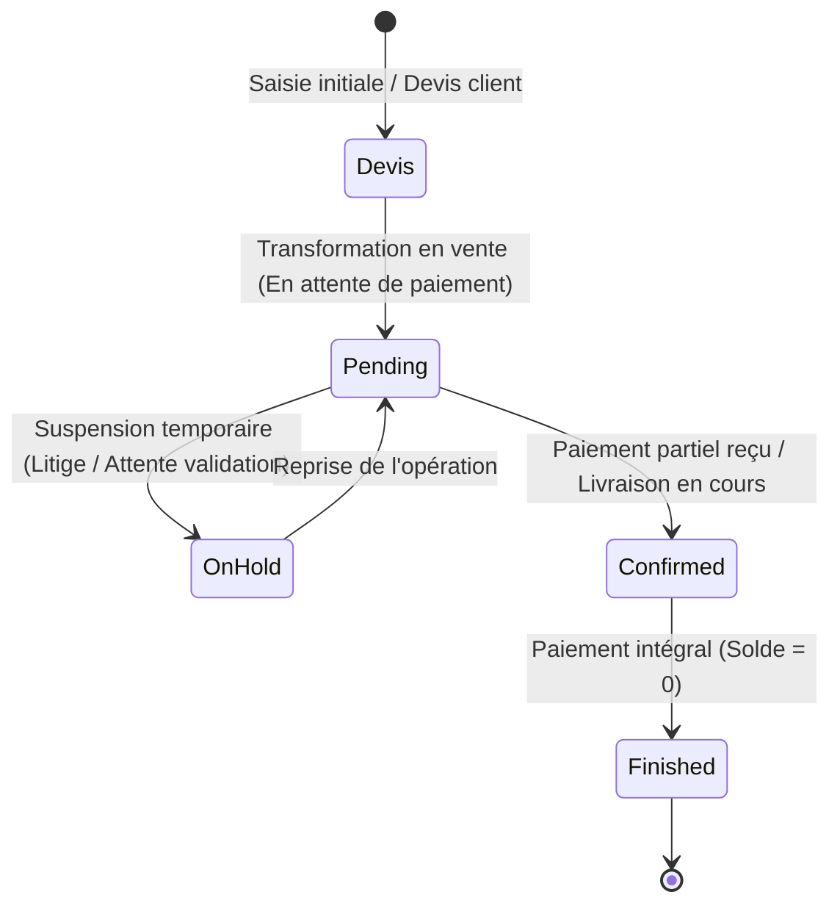
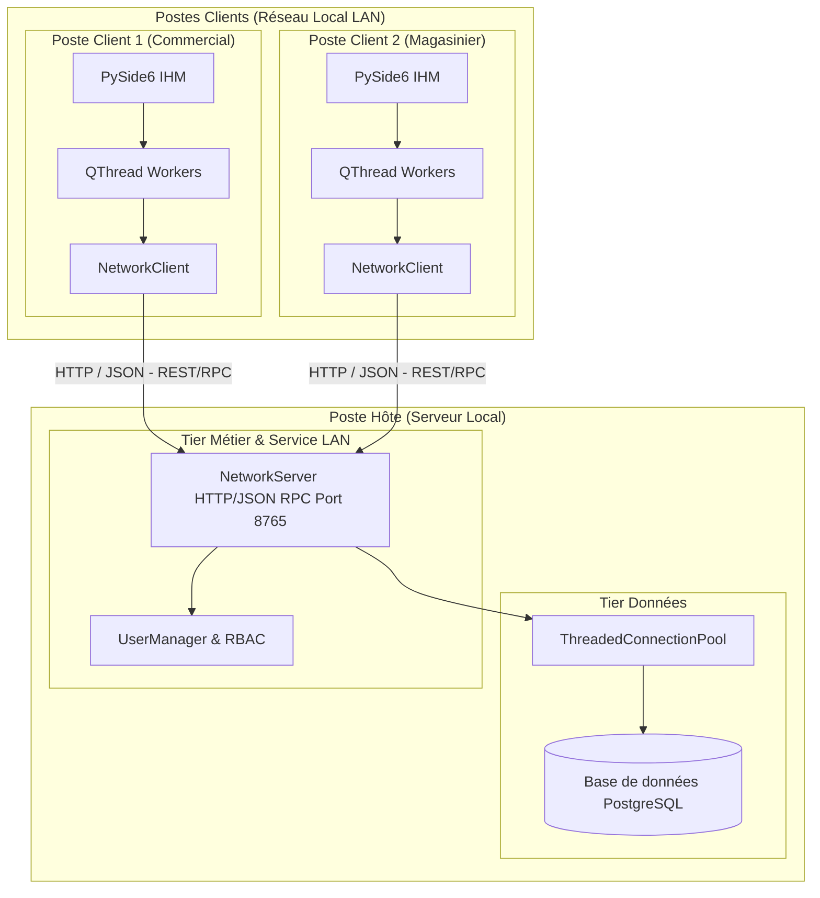
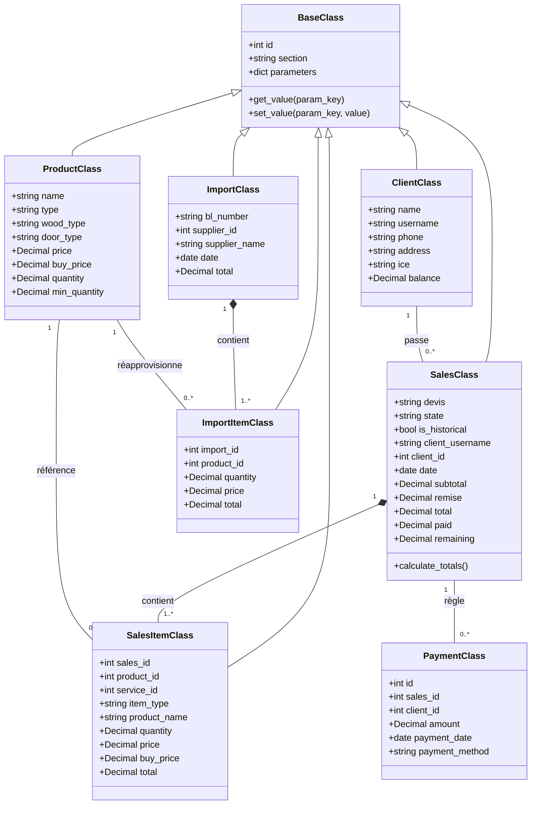

# Chapitre 2 : Méthodologie et Conception — Plan d'Action & Spécifications

> **Document de Référence & Feuille de Route pour le Rapport de Stage (ENSI)**  
> **Projet :** PyLocalInventory — Système de Gestion Commerciale et d'Inventaire en Réseau Local (LAMIDAP)  
> **Formatage ENSI :** Interligne 1,15 | Titres Ch. 16 pt | Sous-titres 14 pt / 12 pt | Texte 12 pt justifié | Titre Figure en bas | Titre Tableau en haut

---

## 1. Vue d'Ensemble et Calendrier des Travaux

Le présent document détaille la structure rigoureuse, l'emplacement chronologique, les **diagrammes UML** et les **tableaux académiques** nécessaires à la rédaction du **Chapitre 2 : Méthodologie et Conception** dans Microsoft Word.

### Tableau de Correspondance : Quand et Où insérer chaque Élément

| Section du Rapport | Éléments Visuels (Diagrammes / Tableaux) | Référence Normalisée | Source / Données PyLocalInventory |
| :--- | :--- | :--- | :--- |
| **II.2 — Démarche Méthodologique** | Schéma du cycle 2TUP / Processus Unifié | `Figure 2.1` | Démarche en Y (Branche technique & fonctionnelle) |
| **II.3 — Analyse des Besoins** | Tableau des acteurs et de leurs responsabilités | `Tableau 2.1` | Rôles LAMIDAP (Admin, Commercial, Magasinier) |
| **II.3 — Analyse des Besoins** | Diagramme global des cas d'utilisation (Use Case) | `Figure 2.2` | Modules : Ventes, Stocks, Fournisseurs, Rapports |
| **II.3 — Analyse des Besoins** | Diagramme détaillé : Gestion commerciale & Ventes | `Figure 2.3` | Cas d'utilisation Vente normale, historique, Devis |
| **II.3 — Analyse des Besoins** | Fiche descriptive : Créer une vente avec déstockage | `Tableau 2.2` | `classes/sales_class.py` & transaction SQL |
| **II.3 — Analyse des Besoins** | Fiche descriptive : Enregistrer un approvisionnement | `Tableau 2.3` | `classes/import_class.py` & entrées stock |
| **II.4 — Modélisation Dynamique** | Diagramme de séquence : Authentification LAN & Token | `Figure 2.4` | `core/network/server.py` (`/login`, PBKDF2) |
| **II.4 — Modélisation Dynamique** | Diagramme de séquence : Enregistrement Vente asynchrone | `Figure 2.5` | `ui/dialogs/edit_dialogs`, Worker `QThread`, RPC |
| **II.4 — Modélisation Dynamique** | Diagramme de séquence : Génération Document / BDL | `Figure 2.6` | Moteur HTML / Chromium PDF (`report/`) |
| **II.4 — Modélisation Dynamique** | Diagramme d'états : Cycle de vie d'une vente | `Figure 2.7` | États : `pending`, `confirmed`, `finished`, `on_hold` |
| **II.5 — Conception Architecturale** | Architecture 3-Tiers Client-Serveur LAN | `Figure 2.8` | Architecture Hôte PostgreSQL / Clients RPC |
| **II.5 — Conception Architecturale** | Modèle de threading asynchrone (QThread Worker) | `Figure 2.9` | Découplage UI / Tâches de fond sans blocage |
| **II.5 — Conception Architecturale** | Matrice des permissions RBAC | `Tableau 2.4` | `core/user_manager.py` (`MATRIX_SECTIONS`) |
| **II.6 — Conception des Données** | Diagramme de classes de conception (UML Class) | `Figure 2.10` | Hiérarchie `BaseClass`, `SalesClass`, `ProductClass` |
| **II.6 — Conception des Données** | Modèle Logique des Données (MLD relationnel) | `Figure 2.11` | Schéma relationnel PostgreSQL |
| **II.6 — Conception des Données** | Dictionnaire de données (Tables principales) | `Tableaux 2.5 à 2.8` | `Products`, `Sales`, `Imports`, `Payments` |
| **II.6 — Conception des Données** | Règles de gestion et d'intégrité financière | Formules `(2.1)` à `(2.4)` | Calculs `Decimal` dans `core/calculations.py` |

---

## 2. Structure Rédactionnelle Détaillée du Chapitre 2 (Texte en Français)

Voici le plan complet avec le contenu exact à intégrer dans Word :

```
CHAPITRE 2 : MÉTHODOLOGIE ET CONCEPTION
  II.1 — Introduction
  II.2 — Démarche méthodologique adoptée (Cycle 2TUP)
  II.3 — Analyse fonctionnelle et modélisation des besoins
    II.3.1 — Identification des acteurs du système
    II.3.2 — Diagramme global des cas d'utilisation
    II.3.3 — Diagrammes détaillés par package fonctionnel
    II.3.4 — Fiches descriptives des cas d'utilisation prioritaires
  II.4 — Modélisation dynamique (Diagrammes de séquences et d'états)
    II.4.1 — Authentification et établissement de session LAN
    II.4.2 — Création d'une vente avec déstockage atomique asynchrone
    II.4.3 — Génération et impression des états et documents commerciaux
    II.4.4 — Cycle de vie d'une commande (Diagramme d'états-transitions)
  II.5 — Conception technique et architecture logicielle
    II.5.1 — Architecture Client-Serveur LAN hybride
    II.5.2 — Modèle de multi-threading et gestion de la réactivité IHM
    II.5.3 — Modèle de sécurité et contrôle d'accès basé sur les rôles (RBAC)
  II.6 — Conception des données et modélisation statique
    II.6.1 — Diagramme de classes métier
    II.6.2 — Modèle Logique des Données (MLD)
    II.6.3 — Dictionnaire des données
    II.6.4 — Règles de gestion et contraintes d'intégrité
  II.7 — Conclusion
```

---

## 3. Spécification Détaillée des Diagrammes (Code & Description)

### 3.1. Figure 2.1 : Démarche méthodologique (2TUP — Two Tracks Unified Process)
* **Emplacement :** Sous la section `II.2`.
* **Description :** Illustre la convergence entre la branche fonctionnelle (analyse des besoins métier de LAMIDAP) et la branche technique (contraintes du réseau local LAN, PostgreSQL et PySide6), menant aux phases de conception, réalisation et validation.


> **Figure 2.1 :** *Cycle de développement en Y selon le processus 2TUP.*

---

### 3.2. Figure 2.2 : Diagramme Global des Cas d'Utilisation
* **Emplacement :** Sous la section `II.3.2`.
* **Acteurs :** Administrateur Système, Commercial / Vendeur, Responsable de Stock / Magasinier.


> **Figure 2.2 :** *Diagramme global des cas d'utilisation du système PyLocalInventory.*

---

### 3.3. Figure 2.4 : Diagramme de Séquence — Authentification LAN et Négociation de Session
* **Emplacement :** Sous la section `II.4.1`.
* **Objets participants :** `Utilisateur`, `ClientApp (IHM)`, `NetworkClient`, `NetworkServer (Host)`, `UserManager`, `PostgreSQL`.


> **Figure 2.4 :** *Diagramme de séquence de l'authentification et de la négociation de session LAN.*

---

### 3.4. Figure 2.5 : Diagramme de Séquence — Enregistrement d'une Vente (Exécution Asynchrone)
* **Emplacement :** Sous la section `II.4.2`.
* **Description :** Montre l'utilisation du Worker `QThread` pour empêcher le blocage de l'IHM (`GUI freeze`), la transmission RPC, et la transaction atomique (déstockage + enregistrement des lignes).


> **Figure 2.5 :** *Diagramme de séquence de l'enregistrement asynchrone d'une vente avec déstockage atomique.*

---

### 3.5. Figure 2.7 : Diagramme d'États-Transitions — Cycle de Vie d'une Vente
* **Emplacement :** Sous la section `II.4.4`.


> **Figure 2.7 :** *Diagramme d'états-transitions du cycle de vie d'une vente commerciale.*

---

### 3.6. Figure 2.8 : Architecture Logicielle Globale (Modèle 3-Tiers Hybride LAN)
* **Emplacement :** Sous la section `II.5.1`.


> **Figure 2.8 :** *Architecture logicielle globale 3-tiers en réseau local (LAN).*

---

### 3.7. Figure 2.10 : Diagramme de Classes Métier (UML Class Diagram)
* **Emplacement :** Sous la section `II.6.1`.


> **Figure 2.10 :** *Diagramme de classes de conception du cœur métier.*

---

## 4. Spécification Détaillée des Tableaux Normalisés ENSI

### 4.1. Tableau 2.1 : Identification des Acteurs et Rôles Système
* **Emplacement :** En tête de la section `II.3.1`.

> **Tableau 2.1 :** *Matrice de description des acteurs du système.*

| Acteur | Type | Description du Rôle et Responsabilités |
| :--- | :--- | :--- |
| **Administrateur Système** | Humain (Privilégié) | Configure les profils entreprise, gère les comptes utilisateurs, définit la matrice des droits, réalise les sauvegardes et supervise la base de données. |
| **Commercial / Vendeur** | Humain (Opérationnel) | Gère la relation client, émet les devis, enregistre les ventes au comptoir, encaisse les règlements et édite les factures et bons de livraison. |
| **Responsable des Stocks** | Humain (Opérationnel) | Réceptionne les marchandises fournisseurs (imports), saisit les nouveaux produits et matières, contrôle les niveaux de stock et gère les inventaires. |
| **PostgreSQL / Serveur RPC** | Système (Automatique) | Assure la persistance, garantit les transactions ACID, synchronise les opérations réseau et applique les règles de déstockage. |

---

### 4.2. Tableau 2.2 : Fiche Descriptive — Cas d'Utilisation « Enregistrer une Vente »
* **Emplacement :** Sous la section `II.3.4`.

> **Tableau 2.2 :** *Fiche descriptive du cas d'utilisation : Enregistrer une vente avec déstockage.*

| Champ | Spécification |
| :--- | :--- |
| **Nom du Cas** | Enregistrer une vente avec déstockage automatique |
| **Identifiant** | `CU-VENTE-01` |
| **Acteur Principal** | Commercial / Vendeur |
| **Acteurs Secondaires** | Système de Base de Données PostgreSQL, Serveur RPC |
| **Préconditions** | 1. L'utilisateur est authentifié avec la permission `Sales:write`.<br>2. Le catalogue des produits et clients est chargé. |
| **Déclencheur** | L'utilisateur clique sur le bouton « Nouvelle Vente » puis sélectionne un client et des articles. |
| **Scénario Nominal (Succès)** | 1. L'utilisateur choisit le client (ou en crée un à la volée).<br>2. L'utilisateur ajoute des articles (produits en stock ou prestations de services).<br>3. Le système calcule dynamiquement le sous-total, applique la remise éventuelle, et détermine le montant net à payer en précision fixe `Decimal`.<br>4. L'utilisateur clique sur « Valider ».<br>5. Le worker asynchrone transmet la commande au serveur hôte.<br>6. Le serveur ouvre une transaction SQL, insère l'entête de vente, insère les lignes d'articles, et décrémente la quantité en stock pour chaque produit physique.<br>7. La transaction est validée (`COMMIT`), un identifiant de vente et un numéro de devis/facture unique sont attribués.<br>8. L'IHM confirme la réussite et propose l'impression immédiate du Bon de Livraison ou Facture. |
| **Scénarios Alternatifs** | **A1. Vente historique cochée :** L'opération est archivée comptablement sans impacter le stock actuel.<br>**A2. Rupture de stock détectée :** Si la quantité demandée dépasse le disponible, le système affiche une alerte préventive tout en autorisant la vente si configurée. |
| **Postconditions** | 1. La vente est persistée en base.<br>2. Les quantités en stock des produits concernés sont mises à jour.<br>3. Le solde du client est actualisé. |

---

### 4.3. Tableau 2.4 : Matrice des Permissions RBAC (Role-Based Access Control)
* **Emplacement :** Sous la section `II.5.3`.

> **Tableau 2.4 :** *Matrice des droits d'accès par section et par rôle (Code source : `core/user_manager.py`).*

| Module / Section (`MATRIX_SECTIONS`) | Administrateur (`is_superadmin`) | Rôle Vendeur / Commercial | Rôle Magasinier / Stock |
| :--- | :--- | :--- | :--- |
| **Products** (Produits & Matières) | Lecture / Écriture / Suppression | Lecture seule | Lecture / Écriture / Suppression |
| **Services** (Prestations) | Lecture / Écriture / Suppression | Lecture seule | Aucune |
| **Clients** | Lecture / Écriture / Suppression | Lecture / Écriture | Lecture seule |
| **Suppliers** (Fournisseurs) | Lecture / Écriture / Suppression | Aucune | Lecture / Écriture |
| **Sales** (Ventes & Règlements) | Lecture / Écriture / Suppression | Lecture / Écriture | Aucune |
| **Imports** (Approvisionnements) | Lecture / Écriture / Suppression | Aucune | Lecture / Écriture |
| **Reports** (Rapports Financiers) | Lecture / Écriture / Suppression | Lecture seule | Aucune |
| **Charges** (Dépenses & Frais) | Lecture / Écriture / Suppression | Aucune | Aucune |

---

### 4.4. Tableaux 2.5 à 2.8 : Dictionnaire des Données (Structure Relationnelle PostgreSQL)
* **Emplacement :** Sous la section `II.6.3`.

> **Tableau 2.5 :** *Structure de la table `sales` (En-têtes de ventes).*

| Colonne | Type SQL | Nullable | Clé | Description |
| :--- | :--- | :--- | :--- | :--- |
| `id` | `SERIAL` | Non | **PK** | Identifiant unique de la vente |
| `devis` | `VARCHAR(40)` | Oui | Unique | Référence canonique du document (ex: DE-2026-001) |
| `state` | `VARCHAR(20)` | Non | - | État du cycle de vie (`pending`, `confirmed`, `finished`, `on_hold`) |
| `is_historical` | `BOOLEAN` | Non | - | `True` si vente d'archive sans déstockage |
| `client_id` | `INTEGER` | Oui | **FK** | Référence vers `clients(id)` |
| `client_username`| `VARCHAR(255)`| Non | - | Nom / Raison sociale du client (snapshot persistant) |
| `date` | `DATE` | Non | - | Date d'émission de l'opération |
| `subtotal` | `NUMERIC(14,2)`| Non | - | Montant brut hors remise |
| `remise` | `NUMERIC(14,2)`| Non | - | Montant de la réduction accordée |
| `total` | `NUMERIC(14,2)`| Non | - | Montant net final TTC |
| `paid` | `NUMERIC(14,2)`| Non | - | Montant total réglé par le client |
| `remaining` | `NUMERIC(14,2)`| Non | - | Solde restant dû sur la vente |

> **Tableau 2.6 :** *Structure de la table `sales_items` (Lignes de vente).*

| Colonne | Type SQL | Nullable | Clé | Description |
| :--- | :--- | :--- | :--- | :--- |
| `id` | `SERIAL` | Non | **PK** | Identifiant unique de la ligne |
| `sales_id` | `INTEGER` | Non | **FK** | Référence vers `sales(id)` (`ON DELETE CASCADE`) |
| `product_id` | `INTEGER` | Oui | **FK** | Référence vers `products(id)` (NULL si service/manuel) |
| `service_id` | `INTEGER` | Oui | **FK** | Référence vers `services(id)` |
| `item_type` | `VARCHAR(20)` | Non | - | Type d'élément (`product`, `service`, `manual`) |
| `product_name` | `VARCHAR(255)`| Non | - | Libellé textuel de l'article au moment de la vente |
| `quantity` | `NUMERIC(12,2)`| Non | - | Quantité facturée |
| `price` | `NUMERIC(14,2)`| Non | - | Prix de vente unitaire appliqué |
| `buy_price` | `NUMERIC(14,2)`| Oui | - | Coût d'achat unitaire (pour le calcul du profit net) |
| `total` | `NUMERIC(14,2)`| Non | - | Montant total de la ligne (`quantity * price`) |

> **Tableau 2.7 :** *Structure de la table `products` (Catalogue et stock).*

| Colonne | Type SQL | Nullable | Clé | Description |
| :--- | :--- | :--- | :--- | :--- |
| `id` | `SERIAL` | Non | **PK** | Identifiant du produit |
| `name` | `VARCHAR(255)`| Non | - | Désignation commerciale |
| `type` | `VARCHAR(100)`| Oui | - | Catégorie ou type de produit |
| `price` | `NUMERIC(14,2)`| Non | - | Prix de vente standard |
| `buy_price` | `NUMERIC(14,2)`| Oui | - | Prix d'achat fournisseur moyen |
| `quantity` | `NUMERIC(12,2)`| Non | - | Quantité physique disponible en magasin |
| `min_quantity` | `NUMERIC(12,2)`| Oui | - | Seuil d'alerte pour réapprovisionnement |

---

## 5. Règles de Gestion et Équations Mathématiques Normalisées

Sous la section `II.6.4`, insérer les équations numérotées selon la norme ENSI :

1. **Sous-total brut d'une opération :**
   $$\text{SubTotal} = \sum_{i=1}^{n} (\text{Quantity}_i \times \text{Price}_i) \tag{2.1}$$

2. **Montant total net d'une vente :**
   $$\text{Total} = \max(0, \, \text{SubTotal} - \text{Remise}) \tag{2.2}$$

3. **Mise à jour transactionnelle du stock (Ventes normales uniquement) :**
   $$Q_{\text{stock}}(t+1) = \begin{cases} Q_{\text{stock}}(t) - Q_{\text{vendue}} & \text{si } \text{is\_historical} = \text{False} \\ Q_{\text{stock}}(t) & \text{si } \text{is\_historical} = \text{True} \end{cases} \tag{2.3}$$

4. **Solde restant dû sur la vente :**
   $$\text{Remaining} = \text{Total} - \sum \text{Payments} \tag{2.4}$$

---

## 6. Prochaines Actions Immédiates (Workflow)

1. Valider le plan et les diagrammes ci-dessus.
2. Générer les images des diagrammes (export PNG haute résolution) pour les coller dans Word avec leurs légendes en bas (`Figure 2.X : Titre`).
3. Rédiger le texte de transition et d'explication entre chaque figure et tableau selon le modèle de style ENSI (Times New Roman 12 pt, interligne 1,15).
4. Mettre à jour la Table des matières, la Liste des figures et la Liste des tableaux dans Microsoft Word.
